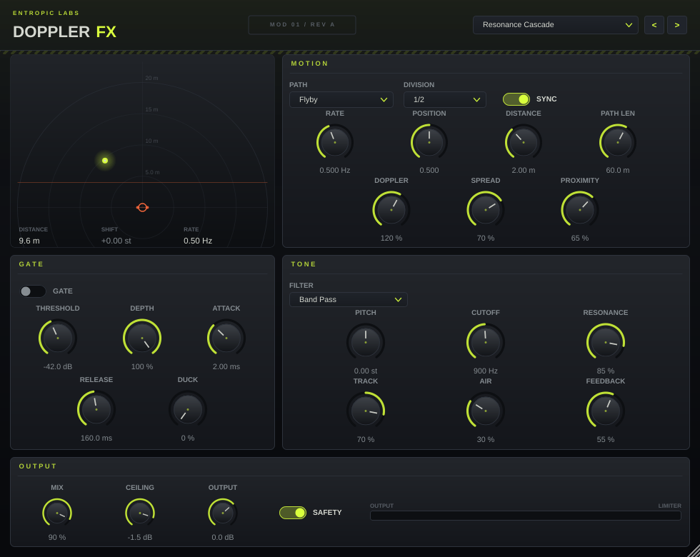

# Doppler FX

**Entropic Labs · MOD 01 / REV A**

A VST3 / AU motion effect. It puts your signal on a virtual sound source that
moves around you, and gives you everything that falls out of that: pitch shift,
propagation delay, the level swell as it arrives, the high end thinning out as
it leaves — plus a resonant filter, a gate and a feedback path to push it well
past realism when you want to.

The output stage is built so it cannot clip your track.



---

## How it works

The effect is not a pitch shifter with an LFO on it. A virtual source travels a
path around a listener with two ears, and for each ear the plugin works out:

| Quantity | Comes from | You hear |
|---|---|---|
| Propagation delay | `distance / 343 m·s⁻¹` | **Pitch shift** — a delay that shortens replays the signal faster |
| Level | inverse distance law | The swell as it arrives, the fall as it leaves |
| HF roll-off | distance | Air absorption, the source going dull in the distance |
| Delay difference between the ears | ear spacing | It moving across the stereo field |

Because the pitch shift comes out of the moving read pointer, it behaves the way
a real passing source does: it bends smoothly, it is strongest at the closest
approach, and it is exactly zero when the source is not moving.

Signal flow:

```
in ──┬──────────────────────────── dry ──────────────┐
     │                                               │
     └─ gate ─┬─ (+ feedback) ─ doppler delay line ───┤
              │       (pitch shift, moving level)     │
              └──────── resonant filter ── air ───────┤
                            │                         │
                            └──── feedback ───────┐   │
                                                  │   │
                                      duck ◄──────┘   │
                            mix ◄─────────────────────┘
                             │
                          output ── DC block ── limiter ── out
```

---

## Not clipping your track

This is a resonant, feeding-back delay whose level swings on purpose, so the
level control is layered rather than left to a single limiter:

1. **Level never boosts.** The inverse-distance law is normalised so the closest
   approach is unity gain. The motion can duck below the dry signal; it can
   never rise above it.
2. **Resonance is gain-compensated.** Filter Q runs up to 18, and the output is
   scaled by `√(0.707 / Q)` as it climbs. You still hear the peak; it cannot
   take the track's headroom with it.
3. **The feedback path is soft-clipped** on the way in, so it saturates
   gracefully instead of squaring up.
4. **A resonance guard watches the recirculating signal.** If it starts to
   build, feedback is eased down until it settles, and recovers slowly enough
   not to read as pumping.
5. **A DC blocker** sits before the output, because an offset is headroom you
   paid for and never hear.
6. **A look-ahead brickwall limiter** finishes the job: reduction starts before
   the peak arrives rather than clipping the front of it.
7. **A hard clip exactly at the ceiling** is the last line, and only ever sees
   the fraction of a dB the limiter's smoothing leaves behind.

Switching the **Safety** limiter off still leaves layers 1–5 and a hard backstop
at 0 dBFS. There is no setting in which this plugin sends something above
0 dBFS to the next device in the chain — there is a test for exactly that.

The limiter's look-ahead is 4 ms; that latency is reported to the host, so the
plugin stays sample-aligned with the rest of your project.

---

## Controls

### Motion

| Control | What it does |
|---|---|
| **Path** | `Flyby` straight line past you · `Orbit` circles a point in front of you (rotary-speaker territory) · `Pendulum` sweeps back and forth, easing at the turns · `Manual` you drive the position |
| **Division** / **Sync** | Locks the motion cycle to host tempo and to the bar line |
| **Rate** | Motion cycles per second when not synced |
| **Position** | Source position in `Manual` mode. Automate this to fly the source by hand |
| **Distance** | How close the source gets at its nearest point. Small values are the dramatic ones |
| **Path Len** | How far it travels. Longer paths mean faster movement for a given rate, so more pitch bend |
| **Doppler** | How far the propagation delay is allowed to swing. 0 % freezes the source, 100 % is physically correct, up to 200 % is deliberately exaggerated |
| **Spread** | Ear spacing. 0 % keeps your source where it is; higher values throw it hard across the stereo field |
| **Proximity** | Depth of the inverse-distance level change |

### Tone

| Control | What it does |
|---|---|
| **Filter** | Low pass / band pass / high pass |
| **Pitch** | A fixed interval, ±12 semitones, on top of the doppler shift. Bypassed and transparent at 0 |
| **Cutoff**, **Resonance** | The filter. Resonance is gain-compensated as it rises |
| **Track** | Ties cutoff to distance. Positive opens up as the source arrives; negative does the opposite |
| **Air** | Air absorption — how much high end is lost over distance |
| **Feedback** | Recirculates the wet signal for a tail that keeps moving. Bounded, so it settles rather than howls |

### Gate

| Control | What it does |
|---|---|
| **Gate**, **Threshold**, **Depth** | A conventional gate, so long tails do not drag room tone and hiss along with them |
| **Attack**, **Release** | Gate timing |
| **Duck** | Ties level to distance instead of to the input. Turns the motion into a rhythmic chop — pair it with **Sync** |

### Output

**Mix** · **Safety** (the limiter) · **Ceiling** (absolute output ceiling) ·
**Output** gain · output and limiter-reduction meter.

---

## Factory presets

Twelve, reachable from the header selector (with `<` `>` to step through them)
and from your DAW's own preset menu — they are exposed as host programs, so in
FL Studio they appear in the wrapper's preset dropdown.

Loading a preset returns every parameter to its default first, so a preset
always sounds the same however the plugin was set when you reached for it.

| Preset | What it is |
|---|---|
| **Calibration** | Everything at default. The reference point |
| **Drive-By** | A source passing you at speed, close and wide. The literal version of the effect |
| **Rotary Chamber** | Tight synced orbit. Rotary-cabinet territory on keys and guitars |
| **Heat Death** | Very slow pendulum over a long path. A riser that takes its time falling apart |
| **Half-Life** | Distance duck on eighths. The motion becomes the rhythm |
| **Brownian Width** | Barely there. A slow drift that widens a source without announcing itself |
| **Centrifuge** | Sixteenth-note orbit, close in and hard. Violent, and still bounded |
| **Decay Chamber** | Heavy feedback with the gate holding the tail back. A room that will not let go |
| **Red Shift** | Pitched down and receding, dark and far off |
| **Blue Shift** | Pitched up and arriving, bright and close |
| **Resonance Cascade** | Band pass at high Q, tracking the motion, fed back on itself. The guard earns its keep here |
| **Vacuum Drift** | Far away, barely moving, almost all high end gone. Background weather |

Every one of them is covered by a test that drives it with full-scale noise and
asserts the output stays inside that preset's own ceiling.

---

## Getting the plugin

### Download a build

Every push builds Windows, macOS and Linux binaries. Open the
[Actions](../../actions) tab, pick the most recent green run, and download the
artefact for your platform.

### Install it

| Platform | Copy `Doppler FX.vst3` to |
|---|---|
| Windows | `C:\Program Files\Common Files\VST3\` |
| macOS | `~/Library/Audio/Plug-Ins/VST3/` (and `Doppler FX.component` to `~/Library/Audio/Plug-Ins/Components/` for AU) |
| Linux | `~/.vst3/` |

### In FL Studio

1. **Options → Manage plugins → Find more plugins** (make sure the VST3 folder
   above is in the plugin search paths).
2. Find **Doppler FX** in the plugin database and mark it as a favourite.
3. Drop it on any **mixer insert slot**. It is a stereo effect and works on
   buses as happily as on single channels.
4. Factory presets are in the wrapper's preset dropdown, and in the plugin's
   own header selector.

The plugin's VST3 class ID is unchanged from the pre-rebrand build, so projects
that already load it keep working — the vendor just reads **Entropic Labs** now.

Because the limiter reports 4 ms of latency, leave FL's plugin delay
compensation on its default automatic setting and everything stays in time.

---

## Building it yourself

Needs CMake 3.22+ and a C++20 compiler. JUCE 8.0.4 is downloaded automatically
at configure time.

```bash
cmake -B build -DCMAKE_BUILD_TYPE=Release
cmake --build build --config Release --parallel
```

Artefacts land in `build/DopplerFX_artefacts/Release/`, as a VST3 bundle, an AU
component on macOS, and a standalone app for trying it without a DAW.

Already have JUCE checked out? Point at it and skip the download:

```bash
cmake -B build -DCMAKE_BUILD_TYPE=Release -DJUCE_PATH=/path/to/JUCE
```

On Linux you will also need:

```bash
sudo apt-get install libasound2-dev libfreetype-dev libfontconfig1-dev \
  libx11-dev libxrandr-dev libxinerama-dev libxcursor-dev \
  libxcomposite-dev libxrender-dev
```

### Tests

`Tests/DspTests.cpp` is a headless harness for the things that are easy to get
wrong and hard to hear:

```bash
ctest --test-dir build -C Release --output-on-failure
```

22 checks. The output never exceeds the ceiling under full-scale noise with
feedback and resonance maxed; the hard backstop holds with the limiter switched
off; the feedback path decays instead of self-oscillating; the geometry really
does raise pitch on approach and lower it on departure; the Pitch control lands
on the interval it claims; silence in gives silence out; NaN or Inf input does
not latch the plugin; and it runs clean from 44.1 kHz to 192 kHz.

On presets: every parameter ID in the bank resolves against a real parameter
(a typo would otherwise silently do nothing), no preset exceeds its own
ceiling, a preset lands identically whatever was loaded before it, programs
report back to the host correctly, and restoring a session keeps the edits you
made on top of a preset rather than re-applying it over them.

It can also render the interface without a display server, which is how the
screenshot above is generated:

```bash
./build/DopplerFXTests_artefacts/Release/DopplerFXTests --screenshot docs/screenshot.png
```

---

## Layout

```
Source/
  PluginProcessor.*      audio thread: parameter plumbing and the per-sample chain
  PluginEditor.*         window layout
  Parameters.*           every automatable parameter, in one place
  Presets.*              the factory bank, exposed as host programs
  dsp/
    FractionalDelay.h    circular delay line, Hermite interpolation
    DopplerEngine.*      path geometry -> per-ear delay, level and distance
    PitchShifter.*       fixed-interval crossfading shifter
    ResonantFilter.*     TPT state variable filter + air absorption
    Gate.*               gate and the distance duck
    Limiter.*            look-ahead brickwall
  gui/
    Theme.h              Entropic Labs palette, stencil type, hazard hatching
    LookAndFeel.*        knobs, drop-downs, switches
    Controls.*           panels, knobs, meter
    RadarDisplay.*       plan view of the virtual space
Tests/DspTests.cpp       headless checks, and the screenshot renderer
```
